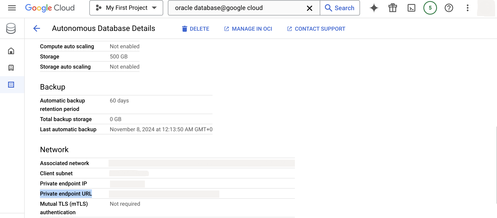
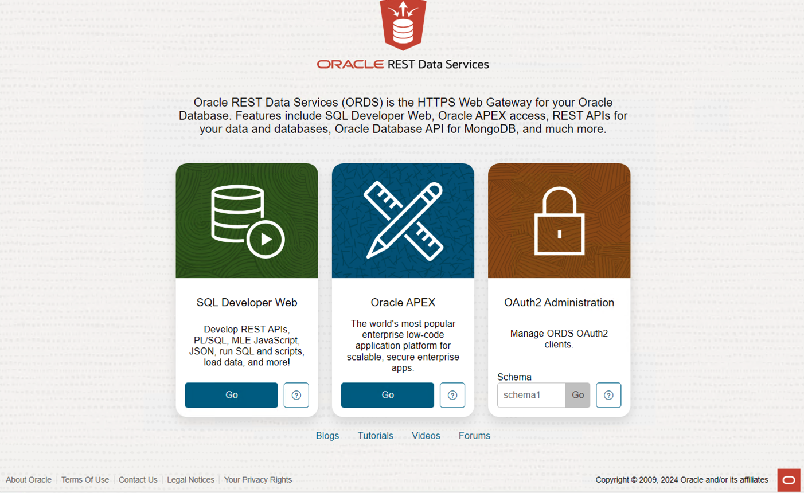
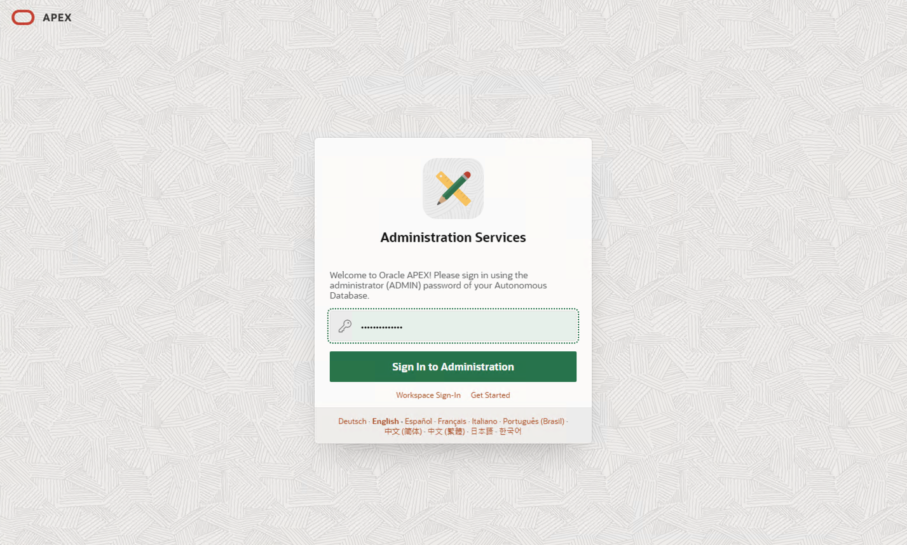
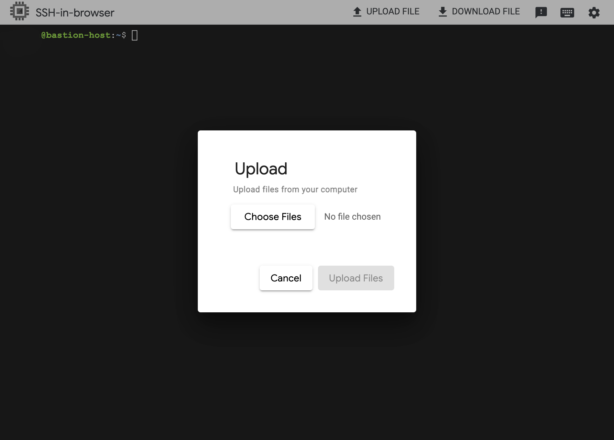
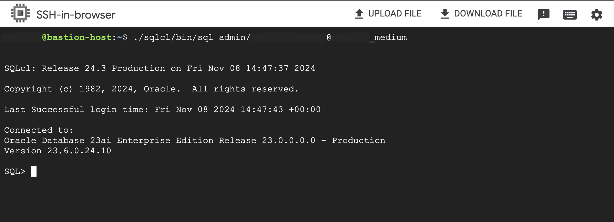

# Deploying Oracle Database on Google Cloud Platform (GCP)

One of the key benefits of using GCP is its ability to support a wide range of databases, including Oracle. In this blog post, we'll focus on deploying an Autonomous Database on Google Cloud Platform (GCP). An Autonomous Database is a self-managing database that automatically handles maintenance tasks, freeing up your time to focus on higher-level tasks.

 We will cover the following topics:

- Creating a virtual private cloud (VPC) network
- Creating subnets and firewall rules
- Creating a bastion host or a Windows VM for easy APEX development
- Deploying an Oracle Autonomous Database
- Configuring instaclient and sqlcl for Oracle Autonomous Database

## Prerequisites

Before we begin, make sure you have the following prerequisites:

- A GCP account with the necessary permissions to create resources
- A Bash shell installed on your system
- The gcloud command-line tool installed and configured on your system
- Oracle Autonomous Database at Google Cloud Platform(GCP) marketplace image

## How to

### Subscribe to Oracle Autonomous Database on GCP

The first step in deploying an Oracle Autonomous Database on GCP is to subscribe to Oracle Database@Google Cloud image.

- Click search bar and type  `marketplace`
 

- In search bar type `oracle`
  

- Click on `subscribe`
  

- Once Image is activated click on `Manage on OCI`
  

- Connect Marketplace offer with an Oracle Account and click on `Create Account`
  

Once your account is approved you can deploy Oracle Autonomous Database on GCP.  

### Deploy Oracle Autonomous Database on GCP

As part of my research for this blog I used a bash script to deploy Oracle Database@Google Cloud.

First I created JSON config file to store some of my variables.

```JSON
{
    "project_id": "your-project-id",
    "region": "your-region",
    "vpc_name": "quickstart-network",
    "bastion_name": "your-bastion-host-name",
    "admin_password": "your-db-admin_password",
    "database_name": "",// I created a user prompt for this
    "database_display_name": "" // I created a user prompt for this
  }
```

Then I created my deploy.sh script.

```bash
#!/bin/bash

# Load configuration from config.json
CONFIG_FILE="config.json"

if [ ! -f "$CONFIG_FILE" ]; then
  echo "Config file not found."
  exit 1
fi

PROJECT_ID=$(jq -r '.project_id' $CONFIG_FILE)
REGION=$(jq -r '.region' $CONFIG_FILE)
VPC_NAME=$(jq -r '.vpc_name' $CONFIG_FILE)
BASTION_NAME=$(jq -r '.bastion_name' $CONFIG_FILE)
ADMIN_PASSWORD=$(jq -r '.admin_password' $CONFIG_FILE)
```

Followed by user input fields, and log generation

```bash
# Ask user for database name and display name
read -p "Enter the database name (letters only): " DATABASE_NAME

while [[ $DATABASE_NAME =~ [^a-zA-Z] ]]; do
  echo "Invalid input. Please enter a database name containing only letters."
  read -p "Enter the database name (letters only): " DATABASE_NAME
done

read -p "Enter the database display name (letters only): " DATABASE_DISPLAY_NAME

while [[ $DATABASE_DISPLAY_NAME =~ [^a-zA-Z] ]]; do
  echo "Invalid input. Please enter a database display name containing only letters."
  read -p "Enter the database display name (letters only): " DATABASE_DISPLAY_NAME
done

# Exit immediately if any command fails
set -e

# Function to log messages
log_message() {
  echo "$(date) - INFO - $1"
}

# Log resource IDs to a file
LOG_FILE="resource_ids.log"

```

### Create a VPC Network

VPC network is a virtual network that provides a secure and isolated environment for your resources.

#### Create VPC

```bash
log_message "Creating VPC..."
VPC_ID=$(gcloud compute networks create $VPC_NAME --subnet-mode=custom --format='get(id)' || { log_message "Failed to create VPC"; exit 1; })
echo "VPC ID: $VPC_ID" >> $LOG_FILE
log_message "VPC created successfully."
```

#### Create Subnets and Firewall Rules

Next, we need to create subnets and firewall rules for our VPC network.

#### Create subnets

Subnets are used to divide a VPC network into smaller segments.

```bash
log_message "Creating subnets..."
PRIVATE_SUBNET_ID=$(gcloud compute networks subnets create private-subnet --network=$VPC_NAME --region=$REGION --range=192.168.5.0/24 --enable-private-ip-google-access --format='get(id)' || { log_message "Failed to create private subnet"; exit 1; })
echo "Private Subnet ID: $PRIVATE_SUBNET_ID" >> $LOG_FILE
PUBLIC_SUBNET_ID=$(gcloud compute networks subnets create public-subnet --network=$VPC_NAME --region=$REGION --range=192.168.4.0/24 --enable-flow-logs --enable-private-ip-google-access --format='get(id)' || { log_message "Failed to create public subnet"; exit 1; })
echo "Public Subnet ID: $PUBLIC_SUBNET_ID" >> $LOG_FILE
log_message "Subnets created successfully."
```

#### Create firewall rules

Firewall rules control incoming and outgoing traffic to and from our resources.


```bash
log_message "Creating firewall rules..."
INGRESS_RULE_ID=$(gcloud compute firewall-rules create allow-common-ports --direction=INGRESS --priority=1000 --network=$VPC_NAME --action=ALLOW --rules=tcp:22,tcp:80,tcp:443,tcp:1522,tcp:3389 --source-ranges=0.0.0.0/0 --description="Allow SSH, HTTP, HTTPS, Autonomous DB, and RDP access" --target-tags=bastion --format='get(id)' || { log_message "Failed to create ingress firewall rule"; exit 1; })
echo "Ingress Firewall Rule ID: $INGRESS_RULE_ID" >> $LOG_FILE
EGRESS_RULE_ID=$(gcloud compute firewall-rules create allow-bastion-egress --direction=EGRESS --priority=1000 --network=$VPC_NAME --action=ALLOW --rules=tcp:22,tcp:80,tcp:443,tcp:1522,tcp:3389 --destination-ranges=0.0.0.0/0 --target-tags=bastion --format='get(id)' || { log_message "Failed to create egress firewall rule"; exit 1; })
echo "Egress Firewall Rule ID: $EGRESS_RULE_ID" >> $LOG_FILE
log_message "Firewall rules created successfully."
```

### Create a Bastion Host and/or Windows VM

Next, I created a bastion host and Windows VM. 

#### Create bastion host

A bastion host is a secure server that acts as an entry point to our VPC network, allowing me to connect to my Oracle Database.

```bash
log_message "Creating bastion host..."
BASTION_HOST_ID=$(gcloud compute instances create bastion-host --zone=$REGION-a --machine-type=e2-micro --subnet=public-subnet --network-tier=PREMIUM --maintenance-policy=MIGRATE --image-family=ubuntu-2004-lts --image-project=ubuntu-os-cloud --boot-disk-size=20GB --boot-disk-type=pd-balanced --boot-disk-device-name=bastion-host --tags=bastion --format='get(id)' || { log_message "Failed to create bastion host"; exit 1; })
echo "Bastion Host ID: $BASTION_HOST_ID" >> $LOG_FILE
log_message "Bastion host created successfully."
```

#### Create Windows VM

Windows VM is a virtual machine that runs the Windows operating system and can be handy if you want quick access to Oracle APEX.

```bash
log_message "Creating Windows VM..."
WINDOWS_VM_ID=$(gcloud compute instances create quickstart-winvm --image-family windows-2022 --image-project windows-cloud --machine-type e2-standard-4 --zone $REGION-a --network $VPC_NAME --network-tier=PREMIUM --subnet public-subnet --boot-disk-size 50GB --boot-disk-type pd-ssd --enable-display-device --tags=bastion --format='get(id)' || { log_message "Failed to create Windows VM"; exit 1; })
echo "Windows VM ID: $WINDOWS_VM_ID" >> $LOG_FILE
log_message "Windows VM created successfully."
```

### Create Oracle Database@Google Cloud

Finally, we can deploy Oracle Database@Google Cloud.

```bash
log_message "Creating database..."
DATABASE_ID=$(gcloud oracle-database autonomous-databases create $DATABASE_DISPLAY_NAME --location=$REGION --display-name=$DATABASE_DISPLAY_NAME --database=$DATABASE_NAME --network=$VPC_ID --cidr=192.168.0.0/24 --admin-password=$ADMIN_PASSWORD --properties-compute-count=2 --properties-data-storage-size-gb=500 --properties-db-version=23ai --properties-license-type=LICENSE_INCLUDED --properties-db-workload=OLTP --format='get(id)' || { log_message "Failed to create database"; exit 1; })
echo "Database ID: $DATABASE_DISPLAY_NAME" >> $LOG_FILE
log_message "Database created successfully."
```

### Connect to Oracle Database@Google Cloud

#### Connect to Oracle Database@Google Cloud APEX UI via Windows VM

- In `Compute Engine` section under `VM instances` you can access Windows VM.

  

- Click on `RDP` to download remote desktop file.  

- Open remote desktop file and login with your windows password.  

  

- Once logged in open browser on your remote `Windows VM` and navigate to Private endpoint URL

  

Then choose Oracle APEX

  

- Login with your admin password and create new `workspace`.

  

- Login to your `workspace`.

  

  

#### Connect to Oracle Database@Google Cloud via sqlcl running on Bastion Machine

- SSH to your Bastion

- Download and install [Oracle Instant Client](https://www.oracle.com/uk/database/technologies/instant-client/linux-x86-64-downloads.html)

```bash
wget https://download.oracle.com/otn_software/linux/instantclient/instantclient-basic-linux.x64-23.4.0.24.05.zip

unzip instantclient-basic-linux.x64-23.4.0.24.05.zip
```

- Set the following environment variables to point to the extracted directory:

```bash
export ORACLE_HOME=/path/to/instantclient_23_4
export LD_LIBRARY_PATH=$ORACLE_HOME:$LD_LIBRARY_PATH
export PATH=$ORACLE_HOME:$PATH
```

Replace `/path/to/instantclient_23_4` with the actual path where you extracted the archive.

- Upload your wallet to the VM

  

- Unzip wallet by running

```bash
unzip <Wallet_Name>.zip
```

Replac 


- Export path to your wallet to TNS_ADMIN  

```bash
export TNS_ADMIN=<PATH TO WALLET>
```

Replace `<PATH TO WALLET>` with the actual path where you extracted wallet zip.

- Install required packages

```bash
sudo apt-get install default-jdk libaio1 libaio-dev
```

- Download SQLCL - [here is official download page for SQLCL](https://www.oracle.com/database/sqldeveloper/technologies/sqlcl/download/)-

```bash
wget https://download.oracle.com/otn_software/java/sqldeveloper/sqlcl-24.3.0.285.0530.zip
```

- Unzip SQLCL

```bash
unzip sqlcl-24.3.0.285.0530.zip 
```

- Run SQLCL to connect to the Oracle Autonomous Database

```bash
./sqlcl/bin/sql admin/password@tnsname_medium
```

  

## Conclusion

In conclusion, deploying an Autonomous Database on GCP requires careful planning and execution. By breaking down the deployment process into smaller tasks and using Ansible playbooks, you can simplify the deployment process and reduce errors. Additionally, using Ansible modules and plugins can help automate repetitive tasks and improve efficiency.

Remember to update your inventory file and playbook according to your specific requirements and GCP configurations. With Ansible, you can easily manage complex deployments on GCP.